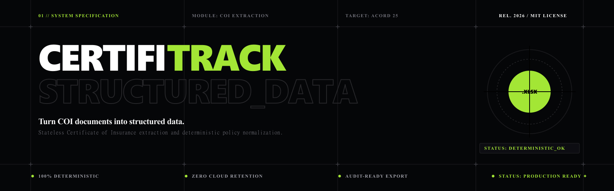
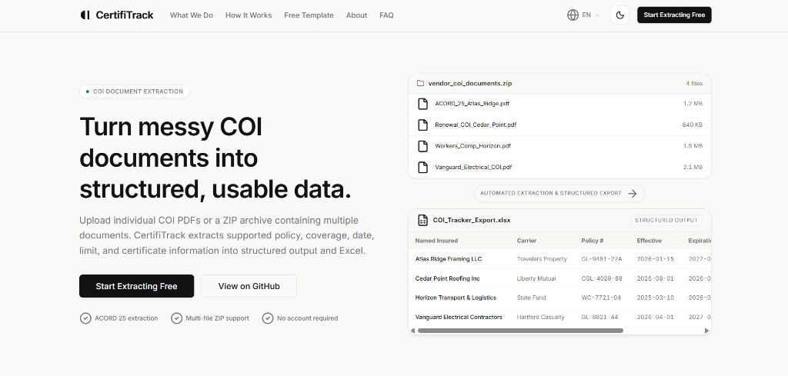
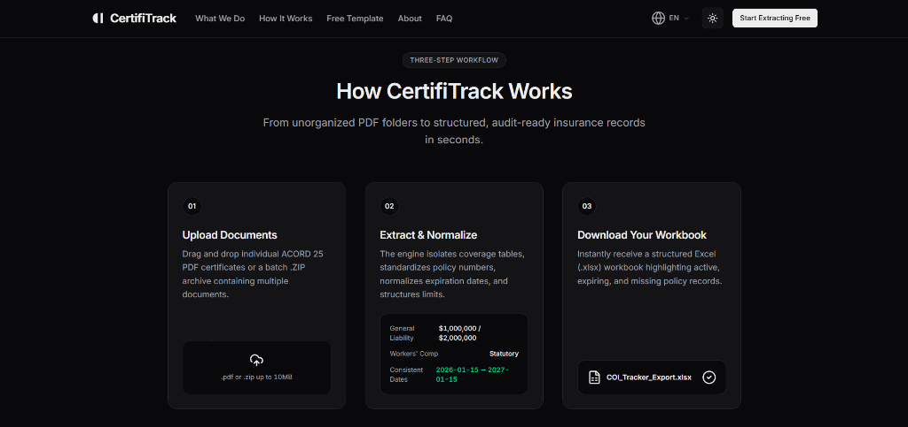
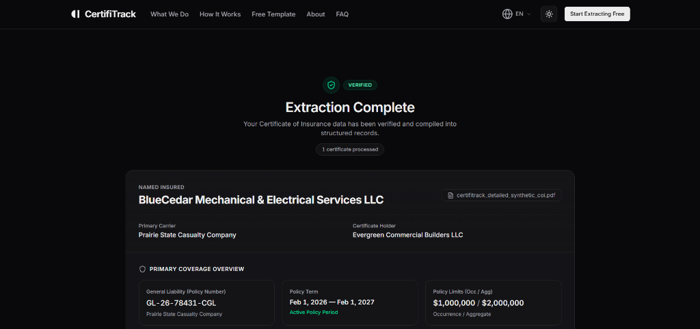
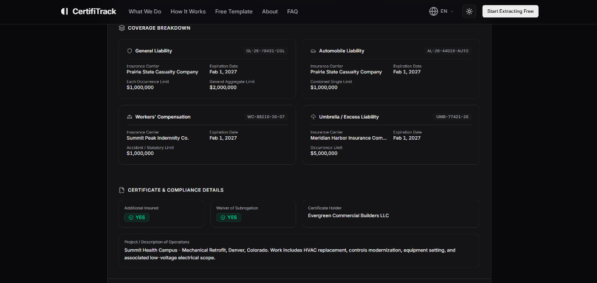

# CertifiTrack

Turn Certificate of Insurance (COI) documents into structured data and Excel workbooks.

<p align="left">
  <a href="LICENSE"></a>
  
  
  
  
  
</p>

<p align="center">
  
</p>

---

## What CertifiTrack Does

In property management, construction, and vendor onboarding, Certificate of Insurance (COI) records are routinely collected as PDF attachments. Operations, risk management, and administrative teams often must manually re-key policy numbers, effective terms, coverage limits, and certificate holder details into tracking spreadsheets—a repetitive and error-prone process.

**CertifiTrack** is an open-source, local-first insurance certificate parser and extraction utility. It extracts supported insurance coverage information from standard ACORD 25 certificates and multi-document ZIP archives, compiling normalized records directly into formatted Excel spreadsheets.

<p align="center">
  
</p>

---

## How It Works

CertifiTrack operates as a streamlined three-step workflow designed to simplify COI extraction and eliminate manual data entry:

<p align="center">
  
</p>

1. **Upload Documents**: Drag and drop individual ACORD 25 PDF certificates or a batch `.zip` archive containing multiple documents.
2. **Extract & Normalize**: The engine isolates coverage schedules, parses policy identifiers, standardizes dates into ISO-8601 (`YYYY-MM-DD`), sanitizes currency limits into clean numeric values, and flags ambiguous fields for review.
3. **Download Your Workbook**: Receive a structured Excel workbook (`.xlsx`) with formatted column widths, status indicators, and complete source document audit lineage.

---

## See It In Action

When extraction completes, CertifiTrack presents the extracted certificate data as structured information, allowing you to review key parties, policy terms, coverage lines, and validation status before exporting to Excel.

### Extraction Summary & Policy Details

<p align="center">
  
</p>

### Coverage Breakdown & Validation Status

<p align="center">
  
</p>

---

## Features

- **COI & ACORD 25 Parsing**: Extracts key parties, policy numbers, effective/expiration dates, and coverage limits from standard insurance certificates.
- **Single PDF & ZIP Batch Processing**: Supports single document uploads and multi-file `.zip` archives with decompression safety verification.
- **Deterministic Offline Processing**: Built-in regex and PDF stream parser runs 100% locally with zero external API dependencies or cloud quota limits.
- **Normalized Dates & Monetary Limits**: Converts varied date conventions into standard `YYYY-MM-DD` and cleans monetary values into numeric formats.
- **Coverage Line Extraction**: Captures General Liability, Automobile Liability, Workers' Compensation, and Umbrella / Excess Liability.
- **Parties & Endorsements**: Extracts Named Insured, Certificate Holder, Producer/Broker, Carrier names, Additional Insured, and Waiver of Subrogation flags.
- **Audit Lineage**: Every extracted row retains its source filename for transparent record traceability.
- **Review Flagging**: Flags missing, incomplete, or ambiguous certificate values with explicit review reasons instead of guessing.
- **Excel (.xlsx) Workbook Generation**: Compiles extracted data into structured spreadsheets with styled headers and status highlights.
- **Stateless Lifecycle & Temp Cleanup**: Files are processed in isolated temporary directories and deleted immediately after extraction.
- **Optional Gemini Provider**: Includes an optional Google Gemini provider for multimodal extraction when explicitly configured.

---

## Supported Data

CertifiTrack extracts and normalizes the following standard insurance certificate fields:

| Category | Extracted Fields |
| :--- | :--- |
| **Certificate & Parties** | Named Insured, Certificate Holder, Producer / Broker, Carrier / Insurer Names, Source Filename |
| **Policy Information** | Policy Numbers, Effective Dates, Expiration Dates, Policy Terms |
| **General Liability** | Policy Number, Term, Each Occurrence Limit, General Aggregate Limit, Products/Completed Ops Limit |
| **Automobile Liability** | Policy Number, Term, Combined Single Limit (CSL), Bodily Injury / Property Damage Limits |
| **Workers' Compensation** | Policy Number, Term, Statutory Limits, E.L. Each Accident, E.L. Disease Policy Limit / Each Employee |
| **Umbrella / Excess Liability** | Policy Number, Term, Each Occurrence Limit, Aggregate Limit, Retention |
| **Compliance & Endorsements** | Additional Insured (`YES` / `NO`), Waiver of Subrogation (`YES` / `NO`), Description of Operations |

---

## Output

CertifiTrack exports extracted data into a canonical **COI Tracker Workbook** (`.xlsx`) containing:

- **Structured COI Records**: Clean rows ready for compliance audits and internal spreadsheet systems.
- **Standardized Formats**: Clean numeric currency columns and uniform ISO date fields.
- **Review Indicators**: Clear visual flags on records where values require manual verification against the source document.
- **Custom Filename Control**: Ability to specify custom export file naming directly before download.

---

## Provider Modes

CertifiTrack provides two distinct operational modes configurable via environment variables:

### 1. Deterministic Mode (Default)
- **Local & Offline**: Parses raw PDF text streams directly on the server without external network requests.
- **Zero API Keys & Zero Quota**: Requires no account, no credentials, and incurs no external usage fees.
- **Configuration** (`backend/.env`):
  ```env
  CERTIFITRACK_PROVIDER=deterministic
  ```

### 2. Gemini Mode (Optional)
- **Multimodal AI Extraction**: Useful for complex certificate layouts or non-standard document formats.
- **Bring Your Own Key (BYOK)**: Requires a user-provided Google Gemini API key.
- **Configuration** (`backend/.env`):
  ```env
  CERTIFITRACK_PROVIDER=gemini
  GEMINI_API_KEY=your_gemini_api_key_here
  GEMINI_MODEL=gemini-3.6-flash
  ```

> **Note**: CertifiTrack does not require Gemini to function. The default deterministic provider handles standard digital ACORD 25 certificates offline.

---

## Local Development

### Prerequisites
- **Node.js**: `>= 22.12.0`
- **npm**: `>= 10.0.0`

### Installation

```bash
# 1. Clone the repository
git clone https://github.com/Kurosyss/certifitrack.git
cd certifitrack

# 2. Install frontend dependencies
npm install

# 3. Install backend dependencies
cd backend
npm install
cd ..
```

### Running Locally

```bash
# Option A: Start both frontend and backend concurrently
npm run dev:all

# Option B: Run in separate terminal sessions
# Terminal 1 — Fastify Backend API (http://127.0.0.1:3000):
npm run dev:backend

# Terminal 2 — Astro Frontend UI (http://localhost:4321):
npm run dev
```

### Production Build

```bash
# Compile static frontend bundle
npm run build

# Preview production build locally
npm run preview
```

---

## Testing

The backend test suite is powered by [Vitest](https://vitest.dev/) and verifies PDF extraction, stream decoding, ZIP archive safety, date/currency normalizers, Excel workbook generation, and API endpoints.

```bash
# Run backend test suite
npm --prefix backend test
```

**Verified Test Results**:
- **Test Files**: 8 passed (8)
- **Tests**: 28 passed (28)

---

## Privacy & Security

- **Stateless Execution**: CertifiTrack does not maintain a database. Uploaded files exist only in volatile temporary directories during the request lifecycle and are purged immediately after processing.
- **No Client-Side Secrets**: All provider credentials remain server-side and are never exposed in frontend bundles.
- **Zip-Slip Mitigation**: Archive extraction strictly validates canonical target paths to prevent directory traversal attacks.
- **Strict Payload Limits**: File uploads are restricted to supported MIME types (`application/pdf`, `application/zip`) with a maximum payload limit of 10MB.

---

## Limitations

- **Scanned Image-Only PDFs**: Deterministic parsing requires readable text streams. Image-only scans without an OCR layer require a multimodal provider.
- **Handwriting**: Handwritten additions cannot be deterministically extracted and are flagged for human review.
- **Informational Utility**: CertifiTrack extracts and organizes document data; it does not provide legal advice, insurance underwriting, or formal compliance certification. All extracted records should be reviewed against original policy documents.

---

## Contributing

Contributions are welcome! To contribute:

1. Fork the repository (`https://github.com/Kurosyss/certifitrack`).
2. Create a feature branch (`git checkout -b feature/improvement`).
3. Ensure all tests pass (`npm --prefix backend test` and `npm run build`).
4. Commit your changes (`git commit -m 'feat: add coverage support'`).
5. Push to your branch and open a Pull Request.

---

## License

This project is licensed under the [MIT License](LICENSE).

---

## Developer

Built and maintained by [Kurosyss](https://github.com/Kurosyss).
